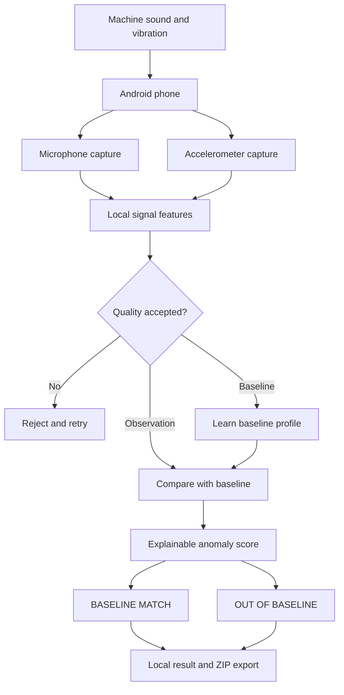
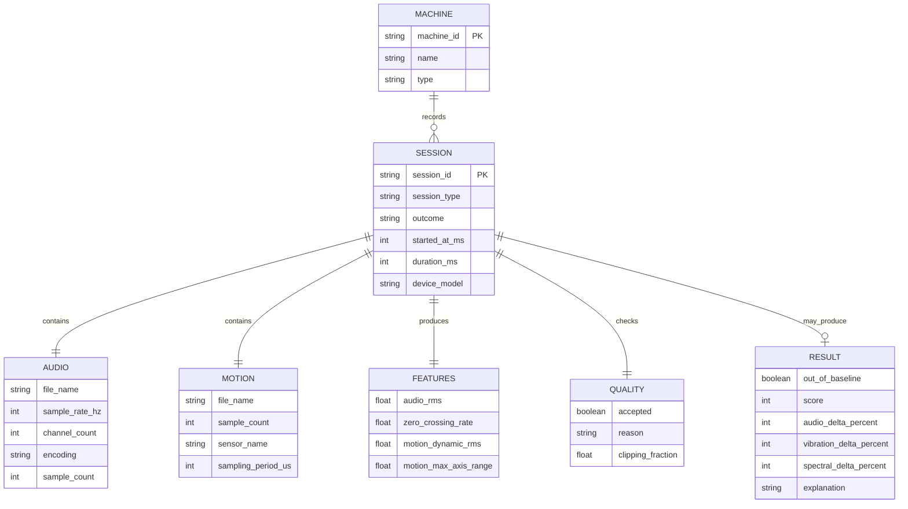

# MachinePulse Edge

> **An AI stethoscope for machines, powered by the sensors already inside an Android phone.**


MachinePulse Edge is a phone-first machine anomaly-screening prototype built for
the **iQOO Hackathon 2026 Open Innovation track**. It records synchronized sound
and vibration, learns a machine's normal operating fingerprint, and checks
whether a later observation remains inside that learned baseline.

The result is intentionally narrow and explainable:

- `BASELINE MATCH`
- `OUT OF BASELINE`

MachinePulse does **not** invent a fault diagnosis or replace certified
industrial condition-monitoring equipment.

## Why It Matters

Small workshops, facility teams, and technicians may not have dedicated sensors
installed on every machine. A modern Android phone already provides a
microphone, accelerometer, local compute, storage, and an accessible interface.
MachinePulse turns that existing hardware into a zero-extra-sensor first-pass
screening tool.

## Verified Prototype

The physical experiment used a table fan, three learned baseline recordings,
one repeated normal observation, and one controlled changed operating state.

| Observation | Quality gate | Result | Score | Key measured change |
| --- | --- | --- | ---: | --- |
| Repeated baseline state | Accepted | `BASELINE MATCH` | 40 | Signals stayed within learned tolerances |
| Moved-phone attempt | Rejected | Not scored | - | Placement instability detected |
| Changed operating state | Accepted | `OUT OF BASELINE` | 999 | Vibration +1542%, acoustic RMS +860% |

The changed fan speed is a **controlled operating-state change**, not a simulated
mechanical fault. Aggregate validation evidence is documented in
[Prototype Validation](docs/results/prototype-validation.md).

## How It Works



1. Record three quality-accepted sessions in the machine's normal state.
2. Capture a new 10-second audio and motion observation.
3. Reject captures affected by phone movement, silence, or audio clipping.
4. Compare acoustic RMS, an acoustic spectral proxy, and vibration energy with
   the learned baseline.
5. Display the result, score, and measured feature deviations locally.

## Session Data Schema

Every accepted or rejected capture is auditable. A shared session ZIP contains
the raw audio, timestamped motion samples, metadata, quality decision, extracted
features, and any comparison result.



```text
machinepulse_session.zip
|-- audio.wav           # mono, 44.1 kHz, PCM 16-bit
|-- accelerometer.csv   # monotonic timestamp + x/y/z acceleration
\-- metadata.json       # device, quality, features, and result
```

## Android Stack

- Kotlin and Jetpack Compose
- Material 3
- `AudioRecord` for mono PCM capture
- `SensorManager` for timestamped accelerometer capture
- Local feature extraction and baseline comparison
- Android `FileProvider` for secure ZIP export

The current prototype was physically validated on a **realme RMX5085** using
standard Android sensor APIs. iQOO-specific performance is not claimed until the
same experiment is run on iQOO hardware.

## Build

Requirements: JDK 17 and an Android SDK with API 37 available.

```bash
cd android/MachinePulse
./gradlew assembleDebug testDebugUnitTest lintDebug
```

The debug APK is generated at:

```text
android/MachinePulse/app/build/outputs/apk/debug/app-debug.apk
```

## Safety And Privacy

- Use only safe built-in machine operating modes.
- Never open, obstruct, damage, or deliberately fault powered equipment.
- Keep phone placement and distance consistent between recordings.
- Avoid private conversations while microphone capture is active.
- Treat outputs as screening evidence, not a mechanical diagnosis.

## License

This project is available under the [MIT License](LICENSE).
