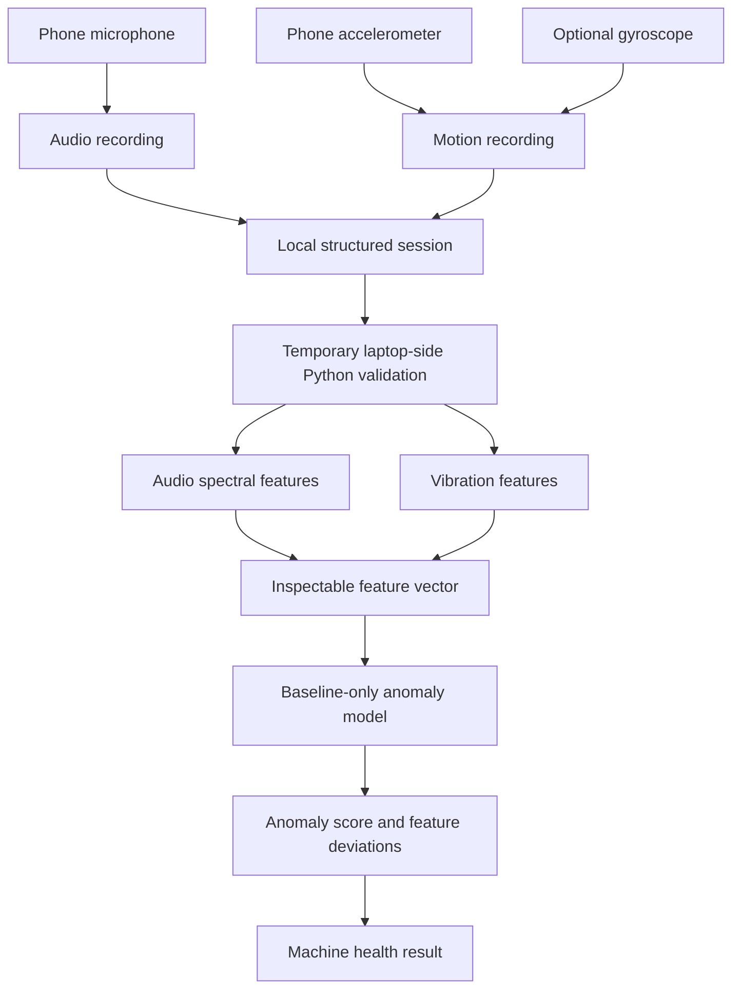

# Architecture

## Validation Architecture

Python on the laptop is a temporary validation boundary for proving the core
signal assumption. It is not the target product architecture.

## Phone-First Target

The target moves preprocessing, feature extraction, scaling, inference, result
history, and evidence explanation onto the phone. Raw recordings stay local and
need not be uploaded to a cloud service. Camera OCR may later add machine context,
but it does not determine anomaly status and is not part of the core experiment.

## Evidence Contract

- Training uses baseline sessions only.
- Evaluation sessions never influence scaling or thresholds.
- Sensor sample rates are estimated from timestamps rather than assumed.
- Missing sensors degrade gracefully and are recorded in metadata.
- Explanations summarize measured feature changes and never invent diagnoses.
